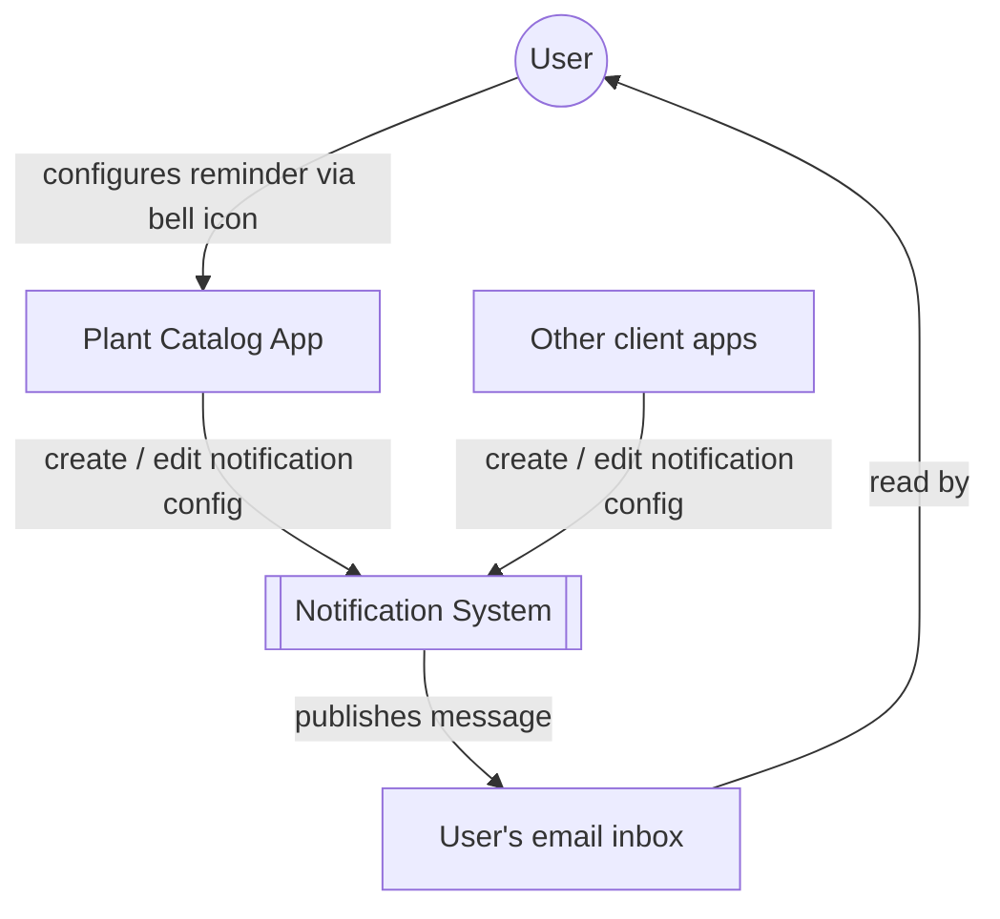
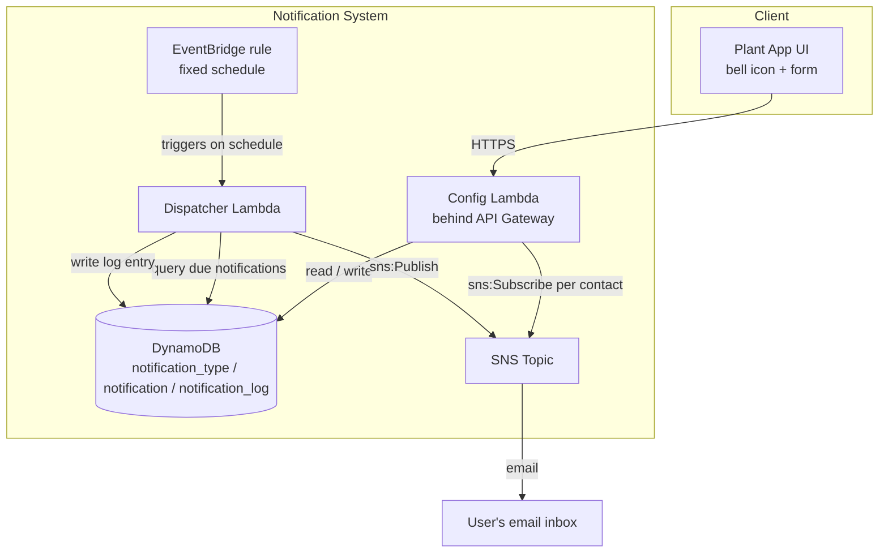
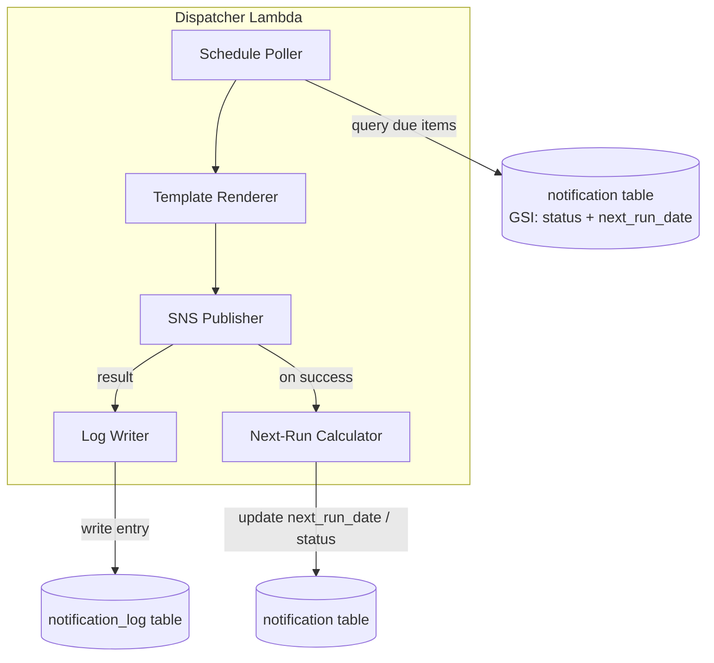
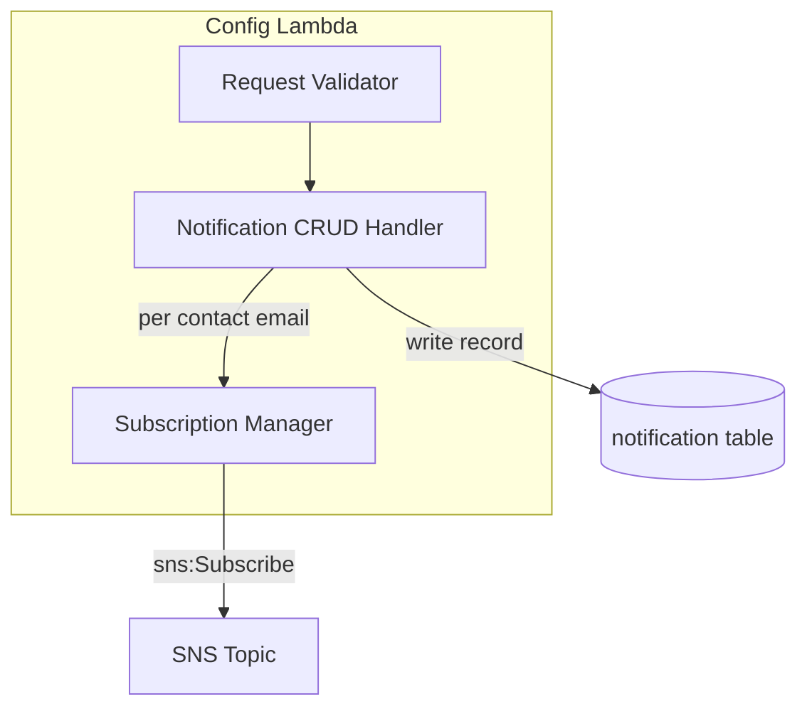
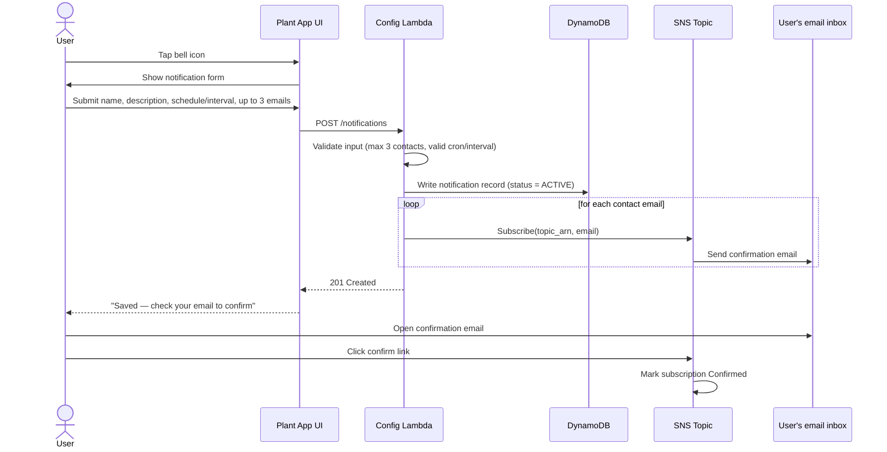

# Notification Feature — Design Documentation

## 1. Functional Requirements

| ID | Requirement |
|----|-------------|
| FR1 | User can access notification setup via a bell icon in the Plant Catalog app. |
| FR2 | User can create a notification with a name, description, schedule type, and up to 3 email contacts. |
| FR3 | User can choose between a cron-style schedule or a fixed interval (radio button, mutually exclusive). |
| FR4 | System sends an SNS subscription-confirmation email to each contact added. |
| FR5 | User can edit their existing notification (name, description, schedule/interval, contacts). |
| FR6 | v1 supports exactly one notification per user; the bell icon always opens that single record (create-if-absent, else edit). |
| FR7 | System automatically dispatches the notification message when its schedule comes due, with no manual trigger. |
| FR8 | System records the outcome (success/failure) of every dispatch attempt. |
| FR9 | The notification feature is generic — not coupled to "plant" as an entity — so other projects can reuse the same tables, Lambda, and topic pattern. |

## 2. Non-Functional Requirements

| ID | Requirement |
|----|-------------|
| NFR1 | **Reusability** — no plant-specific fields in the core schema; `notification_type` is the only per-project customization point. |
| NFR2 | **Reliability** — dispatch is idempotent; a retried Lambda invocation must not double-send. |
| NFR3 | **Observability** — every dispatch attempt (sent or failed) is logged with enough detail to debug a "why didn't I get this" report. |
| NFR4 | **Cost efficiency** — a single scheduled Lambda polls all due notifications, avoiding per-notification EventBridge schedules. |
| NFR5 | **Timeliness** — a notification dispatches within one polling interval of its `next_run_date` (interval TBD, e.g. 15 min). |
| NFR6 | **Security** — Lambdas use least-privilege IAM scoped to the specific DynamoDB tables and SNS topic they need. |
| NFR7 | **Extensibility** — `user_id` is nullable in v1 (no auth yet) but present in the schema so multi-tenancy needs no migration later. |
| NFR8 | **Data integrity** — `contacts` is capped at 3 entries, enforced on write. |

## 3. System Context Diagram



## 4. Container Diagram



## 5. Component Diagram

**Dispatcher Lambda**



**Config Lambda**



## 6. ER Model

```mermaiderDiagram
    NOTIFICATION_TYPE ||--o{ NOTIFICATION : defines
    NOTIFICATION ||--o{ NOTIFICATION_LOG : produces

    NOTIFICATION_TYPE {
        string type_id PK
        string name
        string description
        string created_date
    }

    NOTIFICATION {
        string notification_id PK
        string user_id "nullable, v1 placeholder"
        string type_id FK
        string name
        string description
        string schedule "cron syntax, nullable"
        string interval "nullable"
        string next_run_date
        string status "ACTIVE or PAUSED"
        string topic_arn
        list contacts "max 3, email + subscription_arn"
    }

    NOTIFICATION_LOG {
        string notification_id PK
        string sent_at SK
        string status "SENT or FAILED"
        string sns_message_id
        string error
        string scheduled_for
    }
```

**Note:** `NOTIFICATION` also needs a GSI on `status` (PK) + `next_run_date` (SK) — this is the query the Dispatcher Lambda uses every polling cycle. Not expressible in the ER diagram above but essential to the schema.

## 7. Sequence Diagram — Notification Setup

